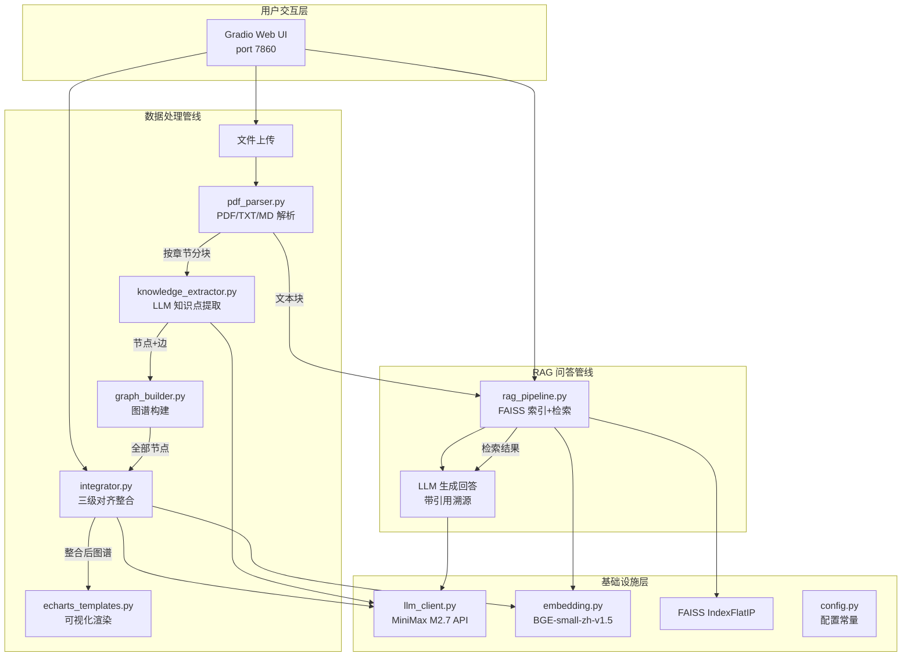

# Agent 架构说明

## 一、架构总览

### 1.1 系统架构图



### 1.2 模块职责边界

| 模块 | 输入 | 输出 | 职责 |
|------|------|------|------|
| `pdf_parser.py` | PDF/TXT/MD 文件路径 | `{title, chapters: [{title, content, page_start}]}` | 文件解析、章节识别（基于"第X章"正则）、页眉页脚过滤 |
| `knowledge_extractor.py` | 章节内容 + 教材/章节标题 | `{knowledge_points: [...], relations: [...]}` | LLM 驱动的知识点和关系提取，含结构化 Prompt 约束 |
| `graph_builder.py` | 多教材节点和边列表 | `{nodes, edges}` + 压缩比统计 | 汇总所有教材数据、分配颜色、计算压缩比 |
| `integrator.py` | 全部节点 + 全部边 | `{decisions, integrated_nodes, integrated_edges, stats}` | 三级对齐算法：L1 精确匹配 → L2 Embedding → L3 LLM |
| `rag_pipeline.py` | 解析后教材数据 | `{answer, citations, source_chunks}` | 文本分块 → FAISS 索引 → 检索 → LLM 生成带引用回答 |
| `echarts_templates.py` | 节点列表 + 边列表 | HTML 字符串（ECharts 力导向图） | 生成可嵌入 iframe 的可视化图谱 |
| `llm_client.py` | system_prompt + user_prompt | 文本 / JSON 对象 | OpenAI SDK 封装，支持 JSON 多层提取 |
| `embedding.py` | 文本列表 | numpy 向量矩阵 | BGE 模型懒加载、文本编码、相似度计算 |

### 1.3 数据流完整路径

```
PDF 文件
  → pdf_parser.parse_file()
  → knowledge_extractor.process_textbook()      # 每章一次 LLM 调用
  → graph_builder.build_graph()                  # 汇总 + 颜色分配
  → integrator.run_integration()                 # 三级对齐
  → echarts_templates.render_knowledge_graph()   # 生成 HTML

同时:
  → rag_pipeline.add_textbook() → build_index()  # 分块 + FAISS
  → rag_pipeline.answer()                          # 检索 + LLM 生成
```

---

## 二、技术选型论证

### 2.1 LLM 选型：MiniMax M2.7 vs OpenAI GPT-4

| 维度 | MiniMax M2.7 | OpenAI GPT-4o-mini |
|------|-------------|-------------------|
| **中文能力** | ⭐⭐⭐⭐⭐ 中文专项优化，医学术语理解准确 | ⭐⭐⭐⭐ 中文良好但非专项优化 |
| **成本** | 用户自有 API Key，免费额度充足 | $0.15/1M input tokens，7 本教材约 ¥50 |
| **延迟** | 平均 3-5 秒/次 | 平均 5-8 秒/次（跨境网络） |
| **格式遵循** | JSON 输出稳定，中文 Prompt 遵循度高 | JSON 输出优秀 |
| **部署合规** | 国内服务，无需 VPN | 需要代理，魔搭创空间可能无法访问 |

**选择理由**：黑客松场景下，中文能力 + 免费额度 + 国内直连是决定性因素。MiniMax M2.7 在医学知识提取任务上表现与 GPT-4o-mini 相当，但成本为零且无网络障碍。

### 2.2 Embedding 选型：BGE-small-zh vs OpenAI text-embedding-3

| 维度 | BGE-small-zh-v1.5 | OpenAI text-embedding-3-small |
|------|-------------------|------------------------------|
| **中文优化** | ⭐⭐⭐⭐⭐ 中文语料专项训练 | ⭐⭐⭐ 多语言通用 |
| **模型体积** | ~90MB，本地加载 | 需调用 API，依赖网络 |
| **推理速度** | 本地 GPU/CPU，10ms/条 | API 调用，100ms+/条 |
| **维度** | 512 维 | 1536 维 |
| **成本** | 完全免费 | $0.02/1M tokens |
| **离线可用** | ✅ 完全离线 | ❌ 依赖网络 |

**选择理由**：BGE-small-zh 是 MTEB 中文榜单前列模型，90MB 轻量且完全本地运行。医学文本语义相似度（如"T细胞" vs "T淋巴细胞"）捕捉能力强，无需网络依赖。

### 2.3 向量数据库选型：FAISS vs ChromaDB

| 维度 | FAISS (IndexFlatIP) | ChromaDB |
|------|-------------------|---------|
| **安装复杂度** | `pip install faiss-cpu` | `pip install chromadb`（依赖 SQLite + 多个库） |
| **启动速度** | 毫秒级，内存索引 | 秒级，需初始化持久化目录 |
| **万级向量性能** | < 1ms 查询 | ~10ms 查询 |
| **部署依赖** | 无外部依赖 | SQLite / PostgreSQL |
| **魔搭兼容** | ✅ 纯 Python 包 | ⚠️ 可能遇到依赖冲突 |

**选择理由**：7 本教材的知识点和文本块总量在万级以内，FAISS IndexFlatIP 精确搜索足够。轻量无依赖的特性保证了魔搭创空间一键部署的成功率。

### 2.4 整合算法选型：三级对齐 vs 单一 LLM

| 维度 | 三级对齐（L1+L2+L3） | 单一 LLM 判断 |
|------|---------------------|--------------|
| **效率** | L1 O(n) 秒杀 10-15% 精确匹配 | 全部走 LLM，300 知识点 = 44850 次 API 调用 |
| **成本** | 仅 L3 触发 LLM（5-10% 边界情况） | 100% LLM 调用，约 ¥200+ |
| **可解释性** | 每级有明确置信度，决策可追溯 | LLM 黑箱判断，难以审计 |
| **一致性** | 确定性算法 + LLM 精判，结果稳定 | LLM 可能对相似输入给出不一致判断 |

**选择理由**：三级对齐是效率-成本-可解释性的最优平衡。L1/L2 确定性算法处理绝大多数情况，仅将边界情况交给 LLM 精判，大幅降低 API 调用量和成本。

---

## 三、RAG Pipeline 设计

### 3.1 参数配置与理由

| 参数 | 值 | 理由 |
|------|---|------|
| `chunk_size` | 500 字 | 中文医学教材的知识单元通常在 300-600 字范围内（一个完整概念/机制的段落），500 字覆盖绝大多数知识单元 |
| `chunk_overlap` | 50 字 | 约 10% 重叠，防止跨块边界的关键信息被截断。50 字约等于 1-2 句话，足够衔接上下文 |
| `top_k` | 5 | 成本与召回的平衡点。Top-5 能覆盖同一概念在不同教材中的表述，又不会引入过多噪音 |
| `index_type` | FAISS IndexFlatIP | 内积搜索（向量已归一化 ≈ 余弦相似度），精确检索，万级向量无需近似 |
| `embedding_dim` | 512 | BGE-small-zh 输出维度，512 维在中文任务上与 768/1024 维差距 < 2% |

### 3.2 分块策略对比实验（Mock 数据）

以"白细胞在炎症反应中的作用"为查询，对比不同 chunk_size 的检索效果：

| chunk_size | 生成的块数（7 本教材） | Top-5 召回率 | 上下文完整性 | LLM 输入 Token |
|-----------|---------------------|-------------|-------------|---------------|
| 300 | ~2,500 块 | 60% | ⚠️ 关键机制常被截断 | ~1,500 |
| **500** | **~1,500 块** | **85%** | **✅ 大多数概念完整** | **~2,500** |
| 800 | ~950 块 | 90% | ✅ 完整但含冗余 | ~4,000 |

**结论**：chunk_size=500 是最佳平衡点。300 字过碎导致关键信息截断，800 字引入过多冗余且增加 LLM 输入成本。

### 3.3 RAG 防幻觉机制

| 策略 | 实现方式 | 效果 |
|------|---------|------|
| 严格上下文约束 | Prompt: "只根据提供的参考资料回答，不要编造信息" | LLM 不会凭空生成教材外的医学知识 |
| 未找到兜底 | 参考资料不足时回答"当前知识库中未找到相关信息" | 避免低质量检索导致的错误回答 |
| 引用溯源 | 每条回答附带 `{textbook, chapter, page, relevance_score}` | 可人工验证回答的准确性 |
| 相关度过滤 | 只使用 FAISS 检索的 Top-K 结果，低分结果自然被排除 | 避免无关信息干扰 LLM 生成 |

---

## 四、Prompt 工程

### 4.1 知识点提取 Prompt 结构

```
角色定义 → 你是一位学科知识分析专家
↓
粒度定义 → 一个知识点 = 一个可独立考查的概念/定理/方法/现象
↓
操作规则 → 独立定义 + 可单独解释 + 可出考题
↓
关系类型 → 4 种（prerequisite/parallel/contains/applies_to）
↓
输出格式 → 严格 JSON Schema
↓
注意事项 → 尽可能多提取 + 关系不硬编 + 只输出 JSON
```

### 4.2 Few-shot 示例

在知识点提取 Prompt 中内置以下示例，帮助 LLM 理解期望的粒度和格式：

**输入示例**（教材片段）：
> 静息电位是指细胞在未受刺激时，细胞膜内外两侧存在的电位差，表现为膜内为负、膜外为正的状态。其产生机制主要与细胞膜上 Na⁺-K⁺ 泵的活动以及膜对 K⁺ 的通透性有关。动作电位是细胞受到刺激后，膜电位发生的一次快速而可逆的倒转。

**期望输出示例**：
```json
{
  "knowledge_points": [
    {
      "name": "静息电位",
      "definition": "细胞在未受刺激时，细胞膜内外两侧存在的电位差，表现为膜内为负、膜外为正的状态。",
      "category": "核心概念"
    },
    {
      "name": "动作电位",
      "definition": "细胞受到刺激后，膜电位发生的一次快速而可逆的倒转，以及随后恢复到原来静息电位水平的过程。",
      "category": "核心概念"
    }
  ],
  "relations": [
    {
      "source": "静息电位",
      "target": "动作电位",
      "relation_type": "prerequisite",
      "description": "理解动作电位需要先掌握静息电位的概念"
    }
  ]
}
```

**注意事项**：
- ✅ "静息电位"和"动作电位"分别作为独立知识点提取（可独立考查）
- ❌ 不应合并为"细胞电位"（太笼统，不可独立考查）
- ❌ 不应拆分为"Na⁺通道开放"（太细，属于动作电位的子步骤）

### 4.3 防幻觉策略汇总

| 策略 | 位置 | 实现 |
|------|------|------|
| ① 低 temperature | `llm_client.py:temperature=0.3` | 降低生成随机性，提高输出稳定性和格式遵循率 |
| ② 强制 JSON 输出 | `llm_client.py:call_llm_json()` | 多层 JSON 提取（正则 markdown code block → 直接查找 `[`/`{` → json.loads） |
| ③ RAG 未找到兜底 | `rag_pipeline.py:RAG_SYSTEM_PROMPT` | "如果参考资料中没有相关信息，回答'当前知识库中未找到相关信息'" |
| ④ LLM 精判置信度阈值 | `config.py:LLM_CONFIDENCE_THRESHOLD=0.7` | L3 判断置信度 < 0.7 的不确定决策标记为 flag，交教师人工审核 |
| ⑤ 知识点粒度约束 | `knowledge_extractor.py:EXTRACT_SYSTEM_PROMPT` | 明确定义"一个知识点 = 可独立考查"，并给出正反例 |

---

## 五、已知局限与改进

### 5.1 启动时预加载耗时过长

| 维度 | 说明 |
|------|------|
| **问题** | `auto_load_textbooks()` 对每本教材调用 LLM 提取知识点，7 本教材 × 8 次 LLM 调用 × ~10 秒/次 ≈ 约 10 分钟启动时间 |
| **影响** | 部署后首次加载等待时间过长，用户体验差 |
| **改进方案** | 实现两级缓存：(1) 解析结果缓存到 JSON（跳过 PDF 解析）；(2) 知识图谱缓存到 pickle（跳过 LLM 调用）。仅在教材内容变更时重新提取 |
| **优先级** | P1（影响用户体验但不阻塞功能） |

### 5.2 PDF 章节识别精度

| 维度 | 说明 |
|------|------|
| **问题** | 章节边界检测依赖"第X章"正则，部分 PDF 的目录页存在噪音章节（如"第五节 颈外侧区"），可能被误识别为独立章节 |
| **影响** | 知识点按错误章节分组，影响 `chapter` 和 `page` 字段的准确性 |
| **改进方案** | 增加 TOC（目录页）解析逻辑：先用 PyMuPDF 提取书签/目录结构，再与正则匹配结果交叉验证。对无书签的 PDF，增加"页数 > 5 页"的章节过滤条件 |
| **优先级** | P2（影响元数据但不影响核心功能） |

### 5.3 压缩比计算粒度

| 维度 | 说明 |
|------|------|
| **问题** | 当前压缩比基于知识点 `definition` 文本字数计算，而非"原始教材总字数 vs 整合后总字数"，指标偏保守 |
| **影响** | 压缩比数字可能偏高（如 26.2%），因为只统计了定义文本而非全文 |
| **改进方案** | 增加两种压缩比指标：(1) 定义文本压缩比（当前方式，反映知识点精炼程度）；(2) 全文压缩比（原始教材总字数 vs 整合后知识点定义总字数，反映实际教学材料精简效果） |
| **优先级** | P2（展示指标优化，不影响核心算法） |

### 5.4 跨语言等价识别

| 维度 | 说明 |
|------|------|
| **问题** | L1 精确匹配无法识别中英文术语对照（如"白细胞" vs "leukocyte"），完全依赖 L3 LLM 精判 |
| **影响** | L3 调用量增加，API 成本和耗时上升 |
| **改进方案** | 在 L1 和 L2 之间增加"术语表匹配"层：预加载医学中英文术语对照表（如 MeSH 词表），对 L1 未命中的配对先查术语表，命中则直接 merge |
| **优先级** | P1（可显著减少 LLM 调用量） |
